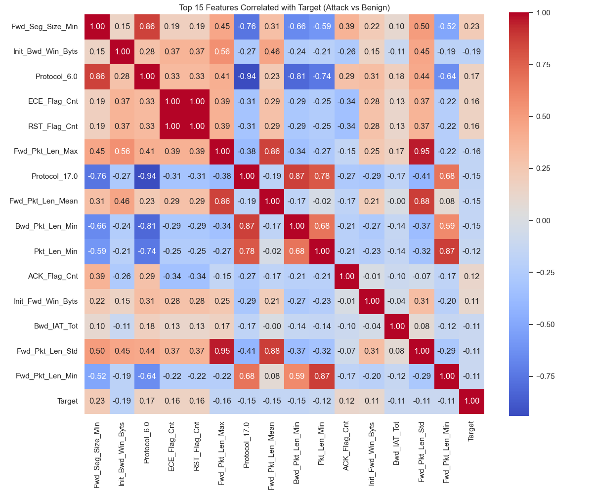
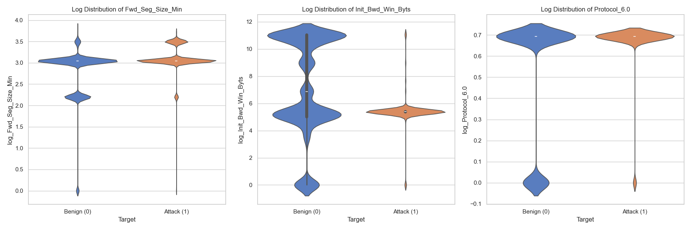
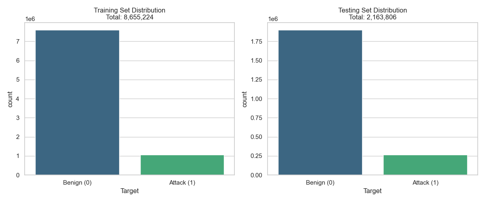

# IPS — Network Intrusion Prevention System

A machine-learning pipeline that classifies network traffic flows as benign or malicious, built on the [CIC-IDS2018](https://www.kaggle.com/datasets/solarmainframe/ids-intrusion-csv) dataset using XGBoost.

The end goal is a two-stage system: a **detection layer** (this repo, in progress) that flags suspicious traffic, followed by a **prevention layer** (planned) that decides how to respond.

---

## Goal

Train an ML model to classify network traffic into:

- **Normal** — benign flows
- **Suspicious** — anomalous but not confidently malicious
- **Dangerous** — confirmed attack patterns

The current scope is a **binary baseline** (benign vs. malicious). A multi-class extension covering all 14 attack types in CIC-IDS2018 will follow.

---

## Workflow

1. **Collect data** — CIC-IDS2018, ~16M flow records across 10 daily CSVs
2. **Explore data** — inspect dimensions, labels, duplicates, nulls, schema drift
3. **Preprocess** — merge → clean → dedup → verify
4. **Encode** — binary target + protocol one-hot
5. **Train** — XGBoost (tree-based, no normalisation required)
6. **Review performance** — PR-AUC, confusion matrix, feature importance, leakage audit

---

## Pipeline

```
Raw CSVs (10 daily files)
        │
        ▼
[Stage 1] Merge ───▶ Merged Parquet ───▶ Verify 1
        │
        ▼
[Stage 2] Clean + Dedup ───▶ Cleaned Parquet ───▶ Verify 2
        │
        ▼
[Stage 3] Encode (target + protocol one-hot)
        │
        ▼
[Stage 4] Train/test split (stratified or time-based)
        │
        ▼
[Stage 5] Train XGBoost
        │
        ▼
[Stage 6] Post-run analysis & viz
```

See [`REPORT.md`](REPORT.md) for the full engineering report with per-stage configuration, drop justification tables, and verification gates.

---

## Preprocessing notes

The dataset arrives as 10 separate CSVs (one per attack day) with schema drift between files (80 vs. 84 columns). The merge stage normalises this and emits an all-string parquet to defer type inference.

The clean stage drops:

- **`Dst Port`** — leakage risk. A model could otherwise memorise that port 22 ↔ DDoS; an attacker switching ports would defeat that shortcut.
- **Near-constant columns** (e.g. `Bwd PSH Flags`, `Fwd URG Flags`, blk-rate avgs) — no information, just noise.
- **Redundant pairs** (Subflow Fwd/Bwd Pkts vs Tot counterparts) — Pearson ≈ 1.0.
- **Rows with negative `Flow Duration`** — a dataset artifact; duration cannot be negative.
- **Inf / NaN rows and exact duplicates.**

Other artifact fixes:

- `Flow IAT Min` and `Fwd IAT Min` had negative values (time can't be negative) → clipped to zero.
- `Init Fwd Win Byts` / `Init Bwd Win Byts` use `-1` as a null sentinel — left as-is. XGBoost will learn `-1` is a flag, not a value.

No normalisation is applied: XGBoost is tree-based and is invariant to monotone scaling, so the step would be wasted work.

---

## Encoding

**Binary baseline (current):**

- **Target:** Benign → `0`, all 14 attack labels → `1`
- **Features:** `Protocol` is one-hot encoded. Although stored as an integer, it is categorical (TCP / UDP / etc.) and treating it as ordinal would invent a false ordering.
- **Column hygiene:** whitespace and slashes in headers replaced with underscores.

**Multi-class (planned):** TBD — will preserve attack-type labels for finer-grained classification.

---

## Generated plots

### Post-clean data

**Correlation heatmap** — sanity-check that redundant pairs were actually dropped.


**Feature separability** — per-feature distribution split by class.


**Stratification check** — train vs. test class balance after split.


### Model run (`run_20260609_154704`)

**Feature importance** — top features by gain.


**Learning curves** — train vs. eval PR-AUC over boosting rounds.


**Confidence histogram** — leakage audit on the held-out set.


---

## Repository layout

```
IPS/
├── dataset/                          raw + split data
├── preprocessing/
│   ├── processes/                    merge + clean scripts
│   ├── verification/                 post-stage assertions
│   ├── processes_output/             merged + cleaned parquet artifacts
│   └── preprocessing_visualisation/  exploratory plots
├── encoding/binary-encoding/         target + protocol encoding
├── train/                            XGBoost training
├── viz/                              post-run analysis
├── models/                           run_<timestamp> artifacts
├── REPORT.md                         full engineering report
└── requirements.txt
```

---

## Running the pipeline

```bash
# Stage 1 — merge
python preprocessing/processes/01_merge_csvs.py \
    --dataset_name cic-ids2018 \
    --input_dir dataset/ids2018_csv \
    --mismatch_action drop

# Stage 1 — verify
python preprocessing/verification/verify_01_merged.py \
    --in_path auto --raw_dir dataset/ids2018_csv

# Stage 2 — clean + dedup
python preprocessing/processes/02_clean_and_dedup.py \
    --in_path auto --split_strat 8020_stratified --encoding_strat binary

# Stage 2 — verify
python preprocessing/verification/verify_02_cleaned.py --in_path auto

# Downstream stages — see REPORT.md §6–9
```

Environment: Python 3.11 on macOS. Dependencies in `requirements.txt`.

---

## Roadmap — Prevention layer

The current pipeline is the **detection** half of an IPS. Once the detection model is locked in, a **prevention layer** will sit on top of it to decide what to *do* about flagged traffic. Two approaches are under consideration:

1. **Signature / rule-based response** — for well-known attack signatures (e.g. known DDoS patterns, port scans), apply deterministic mitigations: block source IP, rate-limit, drop connection. Cheap, fast, explainable.
2. **ML-based action selection** — for traffic that's flagged as malicious but doesn't match a clean signature, a second ML layer predicts the best mitigating action (block / throttle / quarantine / alert-only) given the flow features and threat confidence. Useful for novel or ambiguous attacks where a static rule would either over- or under-react.

The final shape is a hybrid: signature rules as the fast path, ML-based action prediction as the fallback for traffic the rules don't cover.

---

## Status

- [x] Data collection
- [x] Preprocessing pipeline (merge + clean + verify)
- [ ] Binary encoding (refactoring in progress)
- [x] First XGBoost training run + post-run viz
- [ ] Preprocessing exploratory plots on raw merged data
- [ ] Multi-class model
- [ ] Prevention layer (signature rules + ML action selector)
