# IPS — Engineering Report

> Network Intrusion Prevention System using XGBoost on CIC-IDS2018.
> _One-paragraph abstract — what was built, what dataset, what result._

---

## 0. Document metadata
| Author | Awais Rafique |
| Last updated | 14/6/2026 |
| Status | In progress — preprocessing complete, encoding/training/eval pending |
| Repo | `IPS/` |

---

## 1. Objectives

### 1.1 Problem statement
**Goal:** Train an ML model to effectively classify network traffic into different classes:
- Normal
-  Dangerous 

### 1.2 Scope
Binary classification - classifying network traffic as either malicious or benign


### 1.3 Success criteria
Optimal PR-AUC
Low overfitting risk - high generalisation


---

## 2. Environment & reproducibility

### 2.1 System
| Component | Version |
|---|---|
| OS | MacOS |
| Python | 3.11 |


### 2.2 Dependencies
Review requirements.txt

### 2.3 End-to-end re-run
```bash
# Stage 1 — merge
python preprocessing/processes/01_merge_csvs.py \
    --dataset_name cic-ids2018 \
    --input_dir dataset/ids2018_csv \
    --mismatch_action drop

# Stage 1 — verify
python preprocessing/verification/verify_01_merged.py \
    --in_path auto --raw_dir dataset/ids2018_csv

# Stage 2 — clean + dedup
python preprocessing/processes/02_clean_and_dedup.py \
    --in_path auto --split_strat 8020_stratified --encoding_strat binary

# Stage 2 — verify
python preprocessing/verification/verify_02_cleaned.py --in_path auto

# (downstream stages — see chapters 4–6)
```

---

## 3. Repository layout

```
IPS/
├── dataset/                          # raw + split data
├── preprocessing/
│   ├── processes/                    # merge + clean scripts
│   ├── verification/                 # post-stage assertions
│   ├── processes_output/             # merged + cleaned parquet artefacts
│   └── preprocessing_visualisation/  # exploratory plots (pending)
├── encoding/binary-encoding/         # target + protocol encoding
├── train/                            # XGBoost training
├── viz/                              # post-run analysis
└── models/                           # run_<timestamp> artefacts
```

_Brief one-liner per top-level dir explaining what it owns._

---

## 4. Pipeline architecture

```mermaid
flowchart LR
    A[Raw CSVs<br/>10 daily files] --> B[Stage 1: Merge<br/>01_merge_csvs.py]
    B --> C[Merged Parquet]
    C --> V1{Verify 1}
    V1 --> D[Stage 2: Clean + Dedup<br/>02_clean_and_dedup.py]
    D --> E[Cleaned Parquet]
    E --> V2{Verify 2}
    V2 --> F[Encode<br/>feature_encoding.py]
    F --> G[Encoded Parquet]
    G --> H[Train/Test Split<br/>train_test_split.py]
    H --> I[Train XGBoost<br/>train_xgboost.py]
    I --> J[Post-run Viz<br/>post_run_viz.py]
```



_One paragraph: design intent of the pipeline — staged with verify gates between stages, parquet handoff format, etc._

---

## 5. Preprocessing

> Status: **Complete** (visualisation step pending — see §5.10).

### 5.1 Objectives
_What preprocessing aims to achieve and what it explicitly does not do (no normalisation, no encoding)._

### 5.2 Input inventory
| File | Size (MB) | Rows | Columns |
|---|---:|---:|---:|
| 02-14-2018.csv | _TBD_ | _TBD_ | _TBD_ |
| 02-15-2018.csv | _TBD_ | _TBD_ | _TBD_ |
| 02-16-2018.csv | _TBD_ | _TBD_ | _TBD_ |
| 02-20-2018.csv | _TBD_ | _TBD_ | _TBD_ |
| 02-21-2018.csv | _TBD_ | _TBD_ | _TBD_ |
| 02-22-2018.csv | _TBD_ | _TBD_ | _TBD_ |
| 02-23-2018.csv | _TBD_ | _TBD_ | _TBD_ |
| 02-28-2018.csv | _TBD_ | _TBD_ | _TBD_ |
| 03-01-2018.csv | _TBD_ | _TBD_ | _TBD_ |
| 03-02-2018.csv | _TBD_ | _TBD_ | _TBD_ |
| **Total** | _TBD_ | ~16,233,002 | 80 / 84 |

_Note on the 80 vs 84 column schema drift across files._

### 5.3 Stage 1 — Merge

**Script:** `preprocessing/processes/01_merge_csvs.py`

#### 5.3.1 Design intent
_Why a chunked, all-string parquet merge — RAM safety, defer type inference._

#### 5.3.2 Configuration
| Flag | Default | Purpose |
|---|---|---|
| `--dataset_name` | `cic-ids2018` | Output filename prefix |
| `--input_dir` | `dataset/ids2018_csv` | Raw CSV source |
| `--mismatch_action` | `drop` | `drop` extras or `keep` for downstream cleaning |

#### 5.3.3 Schema mismatch resolution
_The 80 vs 84 column problem. How `resolve_schema_mismatch()` picks a base schema and drops extras. Which files had extras and what those extras were._

#### 5.3.4 Output
| Metric | Value |
|---|---|
| Output file | `cic-ids2018-merged-<timestamp>.parquet` |
| Size | _TBD_ MB |
| Rows | _TBD_ |
| Columns | _TBD_ |
| Runtime | _TBD_ s |
| Compression ratio (vs raw CSV) | _TBD_× |

### 5.4 Stage 1 — Verification

**Script:** `preprocessing/verification/verify_01_merged.py`

_What this script proves before the cleaning stage is allowed to start._

| Check | Pass criterion | Result |
|---|---|---|
| Row count | within 50k of 16,233,002 | _TBD_ |
| Schema width | 80 or 84 cols | _TBD_ |
| All-string dtype | no numeric leakage from CSV reader | _TBD_ |
| Stray header rows detected | recorded count | _TBD_ |
| Null/empty Label rows detected | recorded count | _TBD_ |
| Negative `Flow Duration` rows | recorded count | _TBD_ |
| Negative IAT artefacts | recorded count per column | _TBD_ |
| Near-constant column evidence | unique≤3 AND >99% zero | _TBD_ |
| Redundant-pair correlations | Pearson > 0.9999 | _TBD_ |
| Label distribution | 15 labels | _TBD_ |

### 5.5 Stage 2 — Clean + Dedup

**Script:** `preprocessing/processes/02_clean_and_dedup.py`

#### 5.5.1 Design intent
_Eight ordered steps; interactive checkpoints between each (call out the automation tradeoff)._

#### 5.5.2 Configuration
| Flag | Default | Purpose |
|---|---|---|
| `--in_path` | `auto` (menu) | Source merged parquet |
| `--out_dir` | `preprocessing/processes_output/cleaned_datasets` | Output dir |
| `--split_strat` | _required_ | `8020_stratified` or `time_based` |
| `--encoding_strat` | `binary` | `binary` or `multiclass` |

#### 5.5.3 Drop list
| Group | Count | Columns | Justification |
|---|---:|---|---|
| Near-constant | 10 | Bwd PSH Flags, Fwd/Bwd URG Flags, CWE Flag Count, Fwd/Bwd Byts/b Avg, Fwd/Bwd Pkts/b Avg, Fwd/Bwd Blk Rate Avg | _<unique vals + % zero evidence>_ |
| Redundant Subflow | 4 | Subflow Fwd/Bwd Pkts, Subflow Fwd/Bwd Byts | Pearson ≈ 1.0 with Tot/TotLen counterparts |
| Redundant Seg Size | 2 | Fwd/Bwd Seg Size Avg | Pearson ≈ 1.0 with Pkt Len Mean |
| Leakage | 1 | Dst Port | Risk of port-number memorisation (e.g. port 22 ↔ class) |
| Strategy-conditional | 1 | Timestamp | Dropped for `8020_stratified`, kept for `time_based` |

#### 5.5.4 Cleaning steps (in order)
1. **Load merged Parquet with predefined drops** — _outcome_
2. **Header normalisation** (spaces/slashes → `_`) — _outcome_
3. **Stray header & null label removal** — _rows dropped_
4. **Numeric coercion + ±inf → NaN drop** — _rows dropped_
5. **Negative `Flow_Duration` drop** — _rows dropped_
6. **Duplicate row drop** — _rows dropped, % dedup_
7. **Negative IAT clip-to-zero** — _columns affected_
8. **Write cleaned Parquet** — _output size_

#### 5.5.5 Output
| Metric | Value |
|---|---|
| Output file | `cic-ids2018-cleaned-deduped_<strat>_<enc>_<ts>.parquet` |
| Size | _TBD_ MB |
| Rows | _TBD_ |
| Columns | 62 (binary, 8020_stratified) |
| Total shrinkage | _TBD_ rows (_TBD_%) |
| Runtime | _TBD_ s |

### 5.6 Stage 2 — Verification

**Script:** `preprocessing/verification/verify_02_cleaned.py`

_Quality gate before the dataset is allowed to flow downstream._

| Check | Pass criterion | Result |
|---|---|---|
| Shrinkage report | recorded count + % | _TBD_ |
| Schema width | 62 (8020) or 63 (time-based) | _TBD_ |
| All predefined drops removed | 17 cols absent | _TBD_ |
| Timestamp handling vs split strat | absent / present | _TBD_ |
| Header format | no spaces or slashes | _TBD_ |
| NaN count | 0 | _TBD_ |
| Inf count | 0 | _TBD_ |
| `Flow_Duration` minimum | ≥ 0 | _TBD_ |
| IAT minimums | ≥ 0 | _TBD_ |
| Label cardinality | 15 | _TBD_ |

### 5.7 Drop-decision evidence
_The verifier produces empirical proof for each drop. Include the actual tables here:_

**Near-constant evidence**
| Column | Unique | % Zero | Std Dev | Verdict |
|---|---:|---:|---:|---|
| _TBD_ | | | | |

**Redundant pairs**
| Target (drop) | Base (keep) | Pearson | Verdict |
|---|---|---:|---|
| _TBD_ | | | |

### 5.8 Label landscape (post-clean)
| Label | Rows | % | Class |
|---|---:|---:|---|
| Benign | _TBD_ | _TBD_ | 0 |
| _Attack labels…_ | | | 1 |

_Class imbalance figure — informs `scale_pos_weight` in §8._

### 5.9 Performance profile
| Stage | Input | Output | Runtime | Peak RAM |
|---|---|---|---:|---:|
| Merge | _TBD_ MB CSV | _TBD_ MB parquet | _TBD_ s | _TBD_ |
| Verify 1 | merged parquet | logs | _TBD_ s | _TBD_ |
| Clean | merged parquet | _TBD_ MB parquet | _TBD_ s | _TBD_ |
| Verify 2 | cleaned parquet | logs | _TBD_ s | _TBD_ |

### 5.10 Outstanding work
- [ ] Exploratory plots for raw merged data — `preprocessing/preprocessing_visualisation/raw_merged_data_plots/` currently empty
- [ ] Wire up `explore_data.py` against the cleaned dataset path
- [ ] Capture before/after histograms for the 17 dropped columns to visually justify drops

### 5.11 Known limitations
- _Interactive checkpoints block automation — single-flag override would help_
- _All-string intermediate Parquet inflates merged size — tradeoff vs schema flexibility_
- _Exact-match dedup only — near-duplicates not handled_
- _Merge writer is not atomic — partial files possible on mid-run failure_

### 5.12 Reproduction
```bash
python preprocessing/processes/01_merge_csvs.py --dataset_name cic-ids2018 --input_dir dataset/ids2018_csv --mismatch_action drop
python preprocessing/verification/verify_01_merged.py --in_path auto --raw_dir dataset/ids2018_csv
python preprocessing/processes/02_clean_and_dedup.py --in_path auto --split_strat 8020_stratified --encoding_strat binary
python preprocessing/verification/verify_02_cleaned.py --in_path auto
```

---

## 6. Encoding

> Status: _TBD_

### 6.1 Target encoding
_Benign → 0, all 14 attack labels → 1. Reference `feature_encoding.py`._

### 6.2 Feature encoding
_Protocol one-hot (categorical despite integer representation). No normalisation (XGBoost tree-based)._

### 6.3 Output
_Encoded parquet shape, size._

### 6.4 Reproduction
```bash
# TBD
```

---

## 7. Train/test split

> Status: _TBD_

### 7.1 Strategy
_80/20 stratified vs time-based — when each is used._

### 7.2 Stratification verification
_Train vs test attack % — must match within 0.01._

### 7.3 Output
_X_train, X_test, y_train, y_test shapes and sizes._

### 7.4 Reproduction
```bash
# TBD
```

---

## 8. Training

> Status: _TBD_

### 8.1 Model & hyperparameters
_XGBoost config — n_estimators, learning_rate, max_depth, tree_method, scale_pos_weight._

### 8.2 Training procedure
_Eval set, early stopping, monitored metrics._

### 8.3 Run artefacts
_What lands in `models/run_<timestamp>/`._

### 8.4 Reproduction
```bash
# TBD
```

---

## 9. Evaluation

> Status: _TBD_

### 9.1 Metrics
_PR-AUC, classification report, confusion matrix._

### 9.2 Results
_Per-run results table._

### 9.3 Feature importance
_Top 15 features by gain._

### 9.4 Learning curves
_Train vs test PR-AUC over trees._

### 9.5 Leakage audit
_Confidence histogram from `post_run_viz.py`._

---

## 10. Multiclass extension

> Status: Not started.

_Plan, scope, open questions._

---

## 11. Artefact inventory

| Artefact | Producer | Path | Size |
|---|---|---|---:|
| Merged parquet | `01_merge_csvs.py` | `preprocessing/processes_output/merged_datasets/` | _TBD_ |
| Cleaned parquet | `02_clean_and_dedup.py` | `preprocessing/processes_output/cleaned_datasets/` | _TBD_ |
| Encoded parquet | `feature_encoding.py` | _TBD_ | _TBD_ |
| Split matrices | `train_test_split.py` | `dataset/data-splits/` | _TBD_ |
| Trained model | `train_xgboost.py` | `models/run_<ts>/xgboost_ids.json` | _TBD_ |
| Post-run plots | `post_run_viz.py` | `models/run_<ts>/post_run_analysis/` | _TBD_ |

---

## 12. Glossary

| Term | Definition |
|---|---|
| IAT | Inter-Arrival Time |
| PR-AUC | Precision-Recall Area Under Curve |
| IDS / IPS | Intrusion Detection / Prevention System |
| _TBD_ | |

---

## 13. Change log

| Date | Change |
|---|---|
| _TBD_ | Preprocessing complete |
